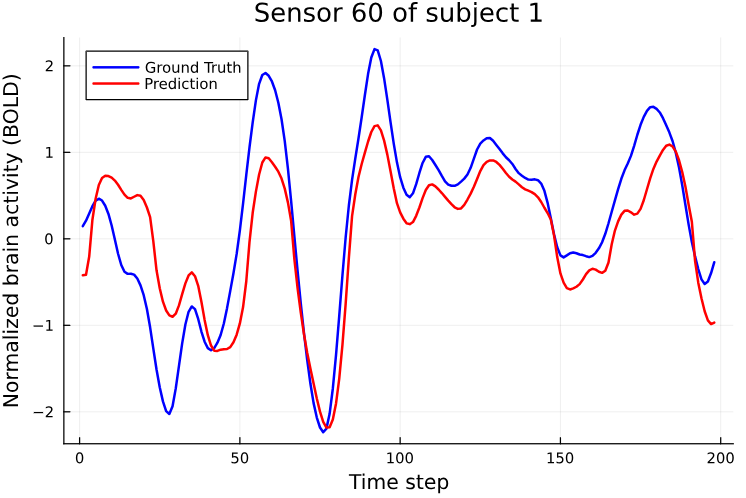

# fMRI Signal Prediction Using Spatio-Temporal Graph Neural Networks

This repository contains code for predicting fMRI signals using Spatio-Temporal Graph Neural Networks written in Julia.

The aim is to predict brain activity from fMRI data by leveraging Spatio-Temporal GNNs to model both spatial and temporal dependencies. This simple project was developed independently and later found to have similarities with a previously published paper titled ["Forecasting brain activity based on models of spatiotemporal brain dynamics: A comparison of graph neural network architectures"](https://direct.mit.edu/netn/article/6/3/665/111069/Forecasting-brain-activity-based-on-models-of), validating the approach and exploring its potential.

## Installation

1. Clone the repository
2. Install the required packages by running the following command in the Julia REPL:

```julia
using Pkg
Pkg.activate(".")
Pkg.instantiate()
```

## Usage

The main script is `training.jl` which contains the code for training and evaluating the model. The script can be run using the following command in the Julia REPL:

```julia
include("src/training.jl")
```

## Data

The data used in this project is from the [Temporal Brain Networks dataset](https://entrepot.recherche.data.gouv.fr/dataset.xhtml?persistentId=doi%3A10.57745%2FPR8VUV) which contains a collection of temporal brain networks. The networks are obtained from resting-state fMRI data of 1047 subjects from the Human Connectome Project (HCP). The data is stored in the `data/resting-state` directory.

## Model

The model used in this project is the Spatio-Temporal Graph Neural Network TGCN from the paper ["T-GCN: A Temporal Graph Convolutional Network for Traffic Prediction"](https://arxiv.org/pdf/1811.05320). The graph is constructed starting from the Schaefer 100 parcellation of the brain, and the fMRI signals are used as node features.

## Results

